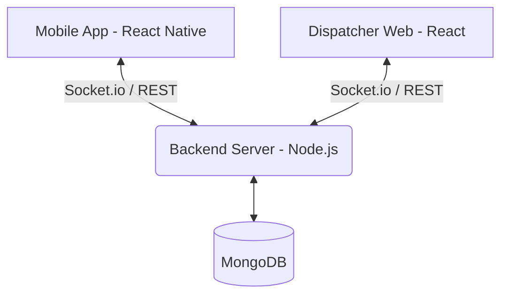

<div align="center">

# 🚑 ResQNet

**Unified Emergency Coordination Platform**

*Built for Kerala, India. Built for when everything else fails.*

[](https://opensource.org/licenses/MIT)
[](https://nodejs.org/)
[](https://reactjs.org/)
[](https://reactnative.dev/)
[](https://www.mongodb.com/)

</div>

<br />

## 📖 Table of Contents
- [About the Project](#-about-the-project)
- [Architecture & Technical Workflow](#-architecture--technical-workflow)
- [Features](#-features)
- [Tech Stack](#-tech-stack)
- [Getting Started](#-getting-started)
  - [Prerequisites](#prerequisites)
  - [Installation & Setup](#installation--setup)
- [Demo Credentials](#-demo-credentials)
- [Environment Variables](#-environment-variables)
- [Contributing](#-contributing)
- [License](#-license)

---

## 🎯 About the Project

**ResQNet** is a robust, real-time emergency coordination platform designed to bridge the gap between citizens in distress, emergency responders, and dispatchers. Built specifically for high-stress scenarios where network connectivity might be limited, it ensures that every SOS call is tracked, assigned, and responded to efficiently.

## 🏗 Architecture & Technical Workflow

The platform consists of three main components communicating in real-time:



### 1. Core Workflow
ResQNet unifies emergency management into a single real-time ecosystem:
- **Dispatcher**: Receives an emergency (SOS or Disaster) and logs it on the Web Panel.
- **Auto-Routing**: The system instantly detects the nearest hospitals, medical camps, and rescue homes and attaches them to the event.
- **Community Alert**: The moment a disaster is logged, all community app users within a 30km radius get an immediate ringing alert.
- **Volunteer Attendance**: Community members tap "✋ I CAN ATTEND" and are instantly synced to the Dispatcher's dashboard as active rescue staff.
- **Convoy & Traffic**: Dispatcher assigns rescue vehicles. As they move, the community app tracks their distance live, issuing escalating warnings (10km, 5km, 2km) to clear the roads.

### 2. Algorithms & Decision Making

**A) Haversine Formula for Geo-Spatial Calculations**
Instead of rough coordinate matching, the backend uses the Haversine formula to calculate exact spherical distance (in kilometers) between two GPS coordinates (Earth's radius R = 6371 km). 
- **Use Case**: Used to filter community members within a strict 30km radius for disaster invites, and to sort hospitals/camps by proximity.

**B) Dynamic Threshold Escalation**
The Community App tracks moving ambulances and dynamically escalates the alert level based on real-time distance:
- `> 5km to 10km`: Mild Notification (Ambulance approaching).
- `> 2km to 5km`: High Alert (Heavy vibration, ringing sound - pull over).
- `< 2km`: Urgent Yield (Maximum vibration pulse, Code Red).

**C) Phantom Feed Deduplication**
The system uses strict event boundary isolation. Instead of creating database alerts on every GPS ping, alerts are tied to explicit Socket events (`disaster:community_alert`). This guarantees the community feed remains clean and actionable.

### 3. APIs & Technology Stack

**1. Overpass API (OpenStreetMap):**
- Used in the backend to dynamically query live nearby Hospitals, Clinics, and Emergency wards based on the incident's Latitude/Longitude.
- It searches within a 20km radius and sorts the results by Haversine distance, returning the top 3 best medical facilities in real-time.

**2. Leaflet (React-Leaflet & Native WebView):**
- Maps are rendered using CartoCDN/OSM tiles. 
- We use web-views inside React Native for the mobile app to ensure complex Leaflet animations (like pulsating ambulance routes) render at 60fps without burdening the native thread.

**3. WebSockets (Socket.io):**
- Completely replaces HTTP polling. 
- State is bidirectional. When a community member clicks "Attend", the socket instantly pushes their identity back to the Dispatcher Dashboard without a page refresh.

### 4. How to Present at the Hackathon

To win, you must sell the "Social Impact" and "Live Synchronization" aspect. 
Here is a 4-step script for your pitch/demo:

- **Step 1: The Problem (Hook)**
  *"Every second counts. Right now, emergency vehicles lose golden minutes stuck in traffic, and willing volunteers have no unified way to respond to local disasters."*

- **Step 2: The Dispatcher (Show Web)**
  *"Watch this. An SOS comes in. Our system uses OpenStreetMap's Overpass API to instantly locate the nearest hospital and safety camp. With one click, we create a Disaster Event. Look what happens to the phone..."*

- **Step 3: The Community (Show Mobile App)**
  *"Instantly, every community member within 30km gets this ringing alert to their phone. Our social impact model invites everyday people to be heroes. I tap 'Attend' on the phone—boom, my name pops up live on the Dispatcher's screen."*

- **Step 4: The Convoy (Show Live Map)**
  *"The dispatcher starts the convoy. As the ambulance moves, the community app calculates the Haversine distance live. 10km away... 5km away... 2km—the app vibrates heavily telling citizens to clear the road. We've gamified goodness and built a unified command center that saves lives."*

## ✨ Features

- **🔐 Secure Authentication**: OTP-based login with automatic demo fallback and 30-day JWT sessions.
- **🚨 Instant SOS Reporting**: Hold-to-SOS functionality with GPS location and customizable status tags.
- **🗺 Live Tracking & Dispatch**: Real-time vehicle location tracking (every 3s) and map visualization utilizing CartoDB dark tiles.
- **🚧 Smart Routing**: AI-powered rerouting via OpenRouteService (ORS) to avoid user-reported traffic blocks.
- **🎙 Voice Broadcasting**: Control room can broadcast voice messages to all field responders instantly.
- **🔔 Community Proximity Alerts**: Nearby community members get 5x vibration and full-screen alerts for incidents within a 500m radius.
- **📶 Offline Resilience**: AsyncStorage queueing with auto-sync when online, paired with a native SMS fallback system when data connectivity is completely lost.
- **🔋 Device Optimization**: Integrated keep-awake mechanisms for drivers during active dispatches.

## 🛠 Tech Stack

- **Backend**: Node.js, Express, MongoDB, Socket.io, JWT, Multer
- **Frontend (Web)**: React, Vite, TailwindCSS, Zustand, Socket.io-client, Leaflet.js
- **Mobile (App)**: React Native, Expo, React Navigation, React Native Maps, Zustand, Expo-AV, Expo-Keep-Awake
- **Mapping & Routing**: CartoDB dark tiles, OSRM routing, OpenRouteService rerouting

---

## 🚀 Getting Started

Follow these instructions to get a copy of the project up and running on your local machine for development and testing purposes.

### Prerequisites

- [Node.js](https://nodejs.org/) (v16 or higher)
- [MongoDB](https://www.mongodb.com/) (Local or Atlas)
- [Expo Go](https://expo.dev/client) app installed on your mobile device (for Android/iOS testing)

### Installation & Setup

#### 1. Backend

```bash
cd backend

# Copy environment variables template
cp .env.example .env

# Install dependencies
npm install

# Seed the database with demo users
npm run seed

# Start the development server (runs on port 5000)
npm run dev
```

#### 2. Dispatcher Web App

```bash
cd dispatcher-web

# Install dependencies
npm install

# Start the development server
npm run dev
```
> The web app will be available at `http://localhost:5173`.  
> Login with phone `+919000000001` and OTP `1234`.

#### 3. Mobile App

```bash
cd mobile

# Install dependencies
npm install

# Start the Expo development server
npx expo start
```
> Scan the generated QR code using the Expo Go app on your Android/iOS device.  
> Login using any of the demo phone numbers and OTP `1234`.

---

## 🔑 Demo Credentials

When `DEMO_MODE=true` is set in the backend `.env`, the OTP for all the following accounts is hardcoded to `1234`.

| Role | Phone Number | Name / Description |
| :--- | :--- | :--- |
| **Dispatcher** | `+919000000001` | Control Room — Kozhikode |
| **Ambulance Driver** | `+919000000002` | Arun Kumar |
| **Fire Rescue Driver** | `+919000000003` | Suresh Nair |
| **Rescue Driver** | `+919000000004` | Biju Thomas |
| **Police Driver** | `+919000000005` | Rajan Pillai |
| **Community Volunteer** | `+919000000006` | Arjun — Mavoor Road |
| **Citizen** | `+919000000007` | Meera — Flood Victim |

---

## ⚙️ Environment Variables

Create a `.env` file in the `backend/` directory using the `.env.example` as a reference.

| Variable | Description | Default |
| :--- | :--- | :--- |
| `PORT` | The port on which the backend server runs | `5000` |
| `MONGODB_URI` | MongoDB connection string | `mongodb://localhost:27017/resqnet` |
| `JWT_SECRET` | Secret key for signing JSON Web Tokens | `your_secret` |
| `DEMO_MODE` | Enables hardcoded OTPs for demo accounts | `true` |
| `ORS_API_KEY` | *(Optional)* OpenRouteService key for AI rerouting | `null` |

---

## 🤝 Contributing

Contributions are what make the open-source community such an amazing place to learn, inspire, and create. Any contributions you make are **greatly appreciated**.

1. Fork the Project
2. Create your Feature Branch (`git checkout -b feature/AmazingFeature`)
3. Commit your Changes (`git commit -m 'Add some AmazingFeature'`)
4. Push to the Branch (`git push origin feature/AmazingFeature`)
5. Open a Pull Request

## 📄 License

Distributed under the MIT License. See `LICENSE` for more information.
